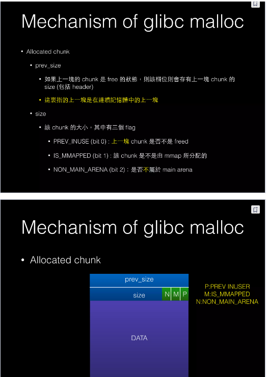

# Array length

Keyword: c/c++ runtimes, heap, memory, ctf, security, docker, container

I stumble upon this question: "Is it possible to get the length of a array in that have been send as ref in a function?". With the background from security (and a CTF enjoyer), my answer is "Yes" and here is how I done it step by step

## PoC implement

A Prove of Concept - PoC mean I can prove it possible via an example, but it not in a general way and can be use in any situation, I get this term from those cvs exploit hacker guy articles and do hope you undertand what I mean here. The final PoC is `arrlen.cpp` file inside this repo directory.

Build the code with `make` command. Or you can run container version (docker/podman/CRO?) using there command. I just want to make sure it work on others machines here.

```sh
sudo docker build -t arrlen .
sudo docker run arrlen
```

I still show the source code here so you won't have to go into the code by your self.

```cpp
// provides `NULL`, `free`, `malloc`, `size_t`
#include <cstdlib>

// provides `printf`
#include <stdio.h>

// This base on gdb trace result, I'm unclear if it still this value in other
// chip architecture: ARM, MISP, ... or with a different glibc implement x64
#define CHUNK_HDR_SZ 16

// Default use case with 4 bytes size
typedef size_t INTERNAL_SIZE_T;

// Chunk header implement base on malloc.c
struct ChunkHeader {
  INTERNAL_SIZE_T prev_size; /* Size of previous chunk (if free).  */
  INTERNAL_SIZE_T size;      /* Size in bytes, including overhead. */
  struct malloc_chunk *fd; /* double links -- used only if free. */
  struct malloc_chunk *bk;
};

// This get the chunk header from a memory address
struct ChunkHeader *mem2chunk(void *mem) {
  if (mem == NULL) {
    return NULL;
  }
  return (ChunkHeader *)((char *)mem - CHUNK_HDR_SZ);
}

// This return alocated data length from malloc
INTERNAL_SIZE_T arrlen(short arr[]) {
  ChunkHeader *p = mem2chunk(arr);
  // Mark with value 0b11...11000
  INTERNAL_SIZE_T mark = (~0) ^ (1 + 2 + 4);

  // Set the first 3 bit to 0 using our crafted mask
  INTERNAL_SIZE_T chunksize = p->size & mark;
  // Get the final data size of the chunk, the array length in bytes
  INTERNAL_SIZE_T arrayLength = chunksize - CHUNK_HDR_SZ;

  return arrayLength;
}

void arrayLenghtPoC(short arr[]) {
  printf("arr pointer (function decay) true size %zu\n", arrlen(arr) / sizeof(short));
}

int main() {
  short *arrPrt;
  arrPrt = (short *)malloc(sizeof(short) * 16);
  for (int i = 0; i < 16; i++) {
    arrPrt[i] = i;
  }

  // Sizeof can't do anything
  printf("arr pointer (sizeof) size %lu\n", sizeof(arrPrt));

  ChunkHeader *p = mem2chunk(arrPrt);
  // Mark with value 0b11...11000
  INTERNAL_SIZE_T mark = (~0) ^ (1 + 2 + 4);
  // Set the first 3 bit to 0 using our crafted mask
  INTERNAL_SIZE_T chunksize = p->size & mark;
  // Get the final data size of the chunk, the array length in bytes
  INTERNAL_SIZE_T arrayLength = chunksize - CHUNK_HDR_SZ;
  printf("arr pointer size %zu\n", arrayLength);

  printf("arr pointer true size %zu\n", arrlen(arrPrt) / sizeof(short));
  arrayLenghtPoC(arrPrt);
  free(arrPrt);
  arrPrt = NULL;
  return 0;
}
```

Output expected after run `sudo docker run arrlen` or run build file directly `dist/arrlen`)
```
arr pointer (sizeof) size 8
arr pointer size 32
arr pointer true size 16
arr pointer (function decay) true size 16
```

## Full walkthough process

### Knowledge check

Of course we can't use array variable `sizeof`. It just get decay to a pointer and lost it size.

```cpp
long long arr[4];
length = sizeof(arr) / sizeof(long long);
```

Just by searching randomly, we will just see some stackoverflow post that you can't do it. But I'm in disbelieve, if c/c++ can't do something then am I suppose to build application in Assembly and reading chip instruction or what. Now, how about heap allocation? Can we free the memory inside a different function.

```cpp
func freeArray(long long arr[]) {
    free(arr);
    // The best practice way to stop free a variable twice, we not do want to
    // start a CTF pwn chalenger here, I just leeting you know
    arr = NULL;
}

int main() {
    arr = (long long*) malloc(sizeof(long long) * 4);
    arr[0] = 1; arr[1] = 2; arr[2] = 3; arr[3] = 4;
    freeArray(arr)
    return 0;
}
```

You actually can, which mean c++ do know in the runtime how long the memory was alocated. This is my theory, we can alway recovered an heap alocated memory size from `malloc()` with just the varible pointer, what ever the case.

### Document readding till we find the root

Now, how exactly can we dig that infomation out? So, I need a good old friends, CTF PWN tutorial for runtime C/C++ executable (more of a crypto guy my self back in the security team). Let look at this [promissing link](https://www.slideshare.net/AngelBoy1/heap-exploitation-51891400).



I don't even know about chinese but there they are, a chunk size. So basically, memory is alocate by `malloc()` will be handle by heap chunk, which have a maximum size (may be of 128KB from previous slide). By using chunk header, we can point them to the next chunk or end of linked chunk (linked list mention! my years of learning data structure finally have a use case!).

There is more to it, like: Large bin, small bin, fast bin, unsorted bin; which just to make memory fragmentation less of a problem but we will skip for now and raise these again when needed.

It will be way easier to look at those chunk when the code actually working and running. I can dump those alocated memory in runtime out directly and manually read the chunk size. But, if `c/c++` have in language API to support runtime infomation extracting like getting chunk/chunk size? How we can navigate the heap chunk? After some time, I found out a Blog post that exlained throughly how glibc `free()` work. It turn out these are the functions that we need to look into:
- `mem2chunk` is simple enough, point backward from the pointer, cast it into a chunk header structure. It seem appear in glibc source code `malloc.c` file, and I can't access that by using `malloc.h` (A non public function)
    ```cpp
    #define mem2chunk(mem) ((mchunkptr)tag_at (((char*)(mem) - CHUNK_HDR_SZ)))
    ```
    But we can re-implementing it tho, simple enough
- `is_mmapped` is a function for flag check in chunk header, we can come back to it after understanding our chunk header object.

Here is the exact quote from the site I found
> Long story short, [free](https://sourceware.org/git/?p=glibc.git;a=blob;f=malloc/malloc.c;h=e065785af77af72c17c773517c15b248b067b4ad;hb=ae37d06c7d127817ba43850f0f898b793d42aea7#l3237) works like the following. When it is called, the user would pass a pointer to the memory area to it, free would then call [mem2chunk](https://sourceware.org/git/?p=glibc.git;a=blob;f=malloc/malloc.c;h=e065785af77af72c17c773517c15b248b067b4ad;hb=ae37d06c7d127817ba43850f0f898b793d42aea7#l1310) to convert the pointer to point to the chunk header. Then, if the chunk is allocated by mmap indicated by the M flag, free calls munmap ([man 3p](https://man.archlinux.org/man/munmap.3p.en) | [man 2](https://man.archlinux.org/man/munmap.2.en)) to release the chunk; if not, it passes the chunk pointer to [_int_free](https://sourceware.org/git/?p=glibc.git;a=blob;f=malloc/malloc.c;h=e065785af77af72c17c773517c15b248b067b4ad;hb=ae37d06c7d127817ba43850f0f898b793d42aea7#l4302) for the actual freeing process.

Now before I try to implement the thing, just to make sure, let find a package that does just that first. I'm using a Ubuntu Jammy (22.04LTS) on x64 (VM) computer for reference. And this is [it?](https://packages.ubuntu.com/jammy/devel/glibc-source)

```sh
ldd --version
# ldd (Ubuntu GLIBC 2.35-0ubuntu3.6) 2.35
# ...
sudo apt install glibc-source
```

Well, getting no where out of that, so I just get the source code

```sh
git clone -b ubuntu/devel https://git.launchpad.net/ubuntu/+source/glibc
```

Let dig into it.

### Implementing the thing

The single `array.cpp` code should cover all of which I have done. You can check it out. With that in mind, let start with a chunk structure in glibc `malloc.c`

```c
struct malloc_chunk {

  INTERNAL_SIZE_T      mchunk_prev_size;  /* Size of previous chunk (if free).  */
  INTERNAL_SIZE_T      mchunk_size;       /* Size in bytes, including overhead. */

  struct malloc_chunk* fd;         /* double links -- used only if free. */
  struct malloc_chunk* bk;

  /* Only used for large blocks: pointer to next larger size.  */
  struct malloc_chunk* fd_nextsize; /* double links -- used only if free. */
  struct malloc_chunk* bk_nextsize;
};

typedef struct malloc_chunk* mchunkptr;

#define mem2chunk(mem) ((mchunkptr)tag_at (((char*)(mem) - CHUNK_HDR_SZ)))
```

In this code, we have notthing fancy going on, I will explaining it just to make clear

- `INTERNAL_SIZE_T` is (as default) `size_t`, a `unsigned long` number type to contain the length in bytes of a structure/object. The `malloc.c` use a `#define` value here so that we can change it in a specifial case that you want to use `unsign long long` instead.
- `mem2chunk` will point back a `CHUNK_HDR_SZ` (chunk header size) length and cast it to a `mallock_chunk` pointer.
- `tag_at` is unclear, I really don't see how that related to any of the implementation
- It still un-clear for me what is `CHUNK_HDR_SZ` value are from the source code

So I can't use them exactly in the PoC code, but we get close to it enough.

After some time digging the code and can't do anything yet. I check the memory in a runtime using `gdb` debuger to find where my chunk header are. `0x5555555596b0` is the address of (function decay) array, jump it back some bytes to see the header. This is what `gdb` showed me

```
(gdb) i arg
arr = 0x5555555596b0
chunk_hdr_sz = 10
(gdb) f 1
#1  0x00005555555554b9 in main () at array.cpp:89
89        getSize(arrPrt, chunk_hdr_sz);
(gdb) i local
arr = {0, 0, 0, 0}
arrPrt = 0x5555555596b0
arrPrt2 = 0x5555555596e0
chunk_hdr_sz = 10
p = 0x5555555596a6
(gdb) x/40x arrPrt-8
0x5555555596a0: 0x00000000      0x00000000      0x00000031      0x00000000
0x5555555596b0:[0x00010000      0x00030002      0x00050004      0x00070006 # arrPrt start here
0x5555555596c0: 0x00090008      0x000b000a      0x000d000c      0x000f000e]# arrPrt end here
0x5555555596d0: 0x00000000      0x00000000      0x00000051      0x00000000
0x5555555596e0:[0x00010000      0x00030002      0x00050004      0x00070006 # arrPrt 2 start here
0x5555555596f0: 0x00090008      0x000b000a      0x000d000c      0x000f000e
0x555555559700: 0x00110010      0x00130012      0x00150014      0x00170016
0x555555559710: 0x00190018      0x001b001a      0x001d001c      0x0000001e]# arrPrt 2 end here
0x555555559720: 0x00000000      0x00000000      0x000208e1      0x00000000
0x555555559730: 0x00000000      0x00000000      0x00000000      0x00000000
```

Now I asumming that our header should be in between both pointer. Which make these are the chunk_header
```
0x5555555596a0: 0x00000000      0x00000000      0x00000031      0x00000000
...
0x5555555596d0: 0x00000000      0x00000000      0x00000051      0x00000000
```

We only focus in those that have a value. Changing arrPrt2 to `64 + 32 = 96 bytes` change some byte in the `0x5555555596d0` offset too
```
0x31 == 0b00110001
0x51 == 0b01010001 -> 0xd1 == 0b11010001
```

for reference
```
16   == 0b00010000 == 0x10
96   == 0b01100000 == 0x60
```

Can't really make any sense of this :'). Gave up time, double it and gave it to my professional friend to solve. And here is what he said:

```
0b00110001
       ^^^ these three is the flag and should be ignore.
    ^^^ Here is the chunk size, but it still need three more leadding 0
```

Making the true size is `0b00110000 = 48 bytes` total. Now while our first array have size `sizeof(short) * 16 = 2 * 16 = 32 bytes`, we have to count in chunk header (16 bytes) into the final size . So the final size fit `32 + 16 = 48 bytes`.

After knowing that, other thing feel quite simple:
```
0x51 == 0b01010001 -> 0b01010000 size -> 80 bytes -> 64 bytes without header
0xd1 == 0b11010001 -> 0b11010000 size -> 208 bytes -> 192 bytes without header
```

It now possible for me to re implement `mem2chunk` and diging `chunk_size`.

## Final take

I covered PoC for Heap, though it still in a single chunk size alocation but it gonna do it for now (PoC isn't a full implementation anyway). About stack alocation, if we can [expanding or trackback call stack](https://www.gnu.org/software/libc/manual/html_node/Backtraces.html) then run the `sizeof()` there, I do think that a general **getting array length native support function** implement into glibc is possible. Until then, the answer for title question is a solid "It depend!", heap alocation "Yes!", stack alocation "Idk yet, have you try it?"

You see, if someone said you can't do X, have some re-thought and use it to ecourage your self digging for the answer from the root instead of blindingly building a blockage on your knowledge. I know as I have done it a lot. It is one of my proud of qualities and allow me to become better both as a developer and as a person.

Source for relevance link that I get infomation from, kudo to the authors:
- https://shuye.dev/blog/malloc_chunk/
- https://www.slideshare.net/AngelBoy1/heap-exploitation-51891400
